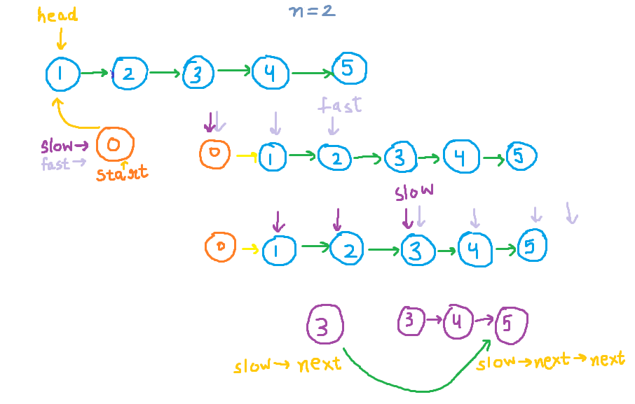

## 19. Remove Nth Node From End of List

##### Easy | C++ Code Solution Explanation | Link List

[Link to the Problem](https://leetcode.com/problems/remove-nth-node-from-end-of-list/)

#### Problem

Given the head of a linked list, remove the nth node from the end of the list and return its head.


#### Solution



- If we move first pointer to nth place and then start both pointers simulataneously.
- When second pointer reaches null the first will be exactly n places behind and hence at the removal position.
- But we need one behind the removal position so we will append a node to the list.

#### Code

```
ListNode* removeNthFromEnd(ListNode* head, int n) {
        ListNode *start=new ListNode();
        start->next=head;
        ListNode *fast=start;
        ListNode *slow=start;
        for(int i=1;i<=n;i++)
        {
            fast=fast->next;

        }
        while(fast->next!=NULL)
        {
            slow=slow->next;
            fast=fast->next;
        }
        slow->next=slow->next->next;
        return start->next;
    }
```
