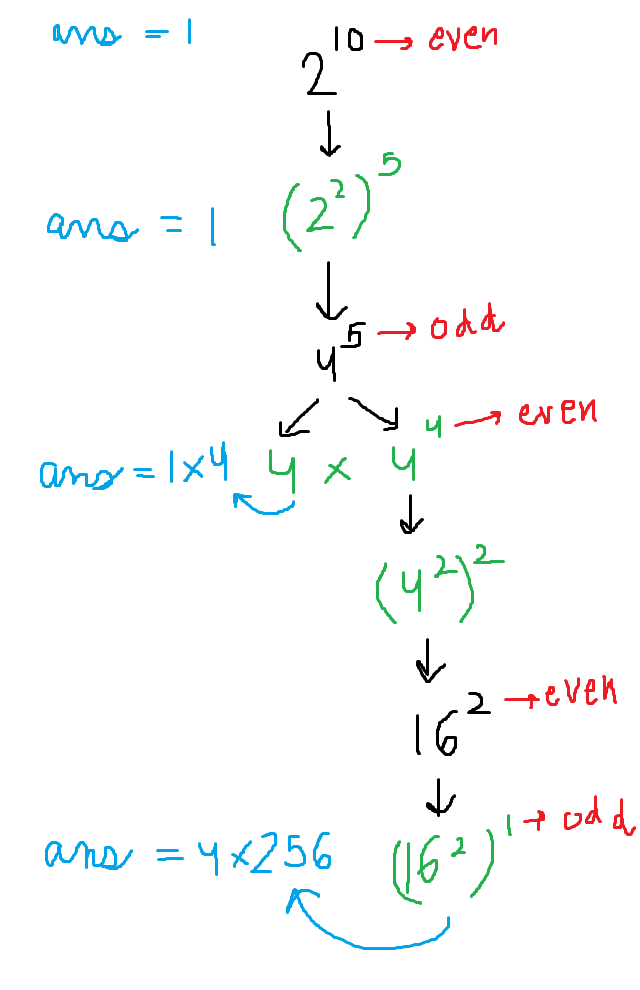

## 50. Pow(x, n)

##### Medium | C++ Code Solution Explanation | Array

[Link to the Problem](https://leetcode.com/problems/powx-n/)

#### Problem

Implement pow(x, n), which calculates x raised to the power n (i.e., xn).

#### Solution



#### Code

```
double myPow(double x, int n) {
        if(n==0)return 1;
        if(n==1)return x;
        double ans = 1;
        int neg=0;
        if(n<0){
            neg=1;
        }

        long long m = labs(n);
        cout<<m;

        while(m>=1){

            if(m%2==0){
                x*=x;
                m/=2;
            }
            else{
                ans*=x;
                m--;
            }
        }

        if(neg==1){
            ans=1/ans;
        }
        return ans;
    }
```
